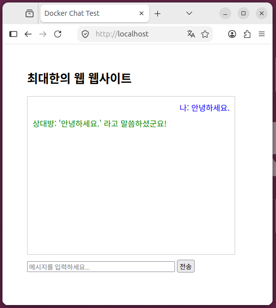

$ ls

```
DockerWebBuild.txt  Dockerfile  bindMountReal.txt  html
```

$ cat Dockerfile

```
FROM nginx:latest
COPY ./html /usr/share/nginx/html
RUN chmod -R 755 /usr/share/nginx/html
```

$ cd html
$ ls

```
index.html  script.js
```

$ cat index.html

```
</html><!DOCTYPE html>
<html lang="ko">
<head>
    <meta charset="UTF-8">
    <title>Docker Chat Test</title>
    <style>
        body { font-family: sans-serif; margin: 50px; }
        #chat-box { width: 400px; height: 300px; border: 1px solid #ccc; overflow-y: scroll; padding: 10px; margin-bottom: 10px; }
        .message { margin-bottom: 8px; }
        .user { text-align: right; color: blue; }
        .bot { text-align: left; color: green; }
    </style>
</head>
<body>

    <h2>최대한의 웹 웹사이트</h2>
    <div id="chat-box"></div>
    
    <input type="text" id="user-input" placeholder="메시지를 입력하세요..." style="width: 300px;">
    <button onclick="sendMessage()">전송</button>

    <!-- 자바스크립트 파일 연결 -->
    <script src="script.js"></script>
</body>
</html>
```

$ cat script.js

```
function sendMessage() {
    const inputField = document.getElementById("user-input");
    const chatBox = document.getElementById("chat-box");
    const userText = inputField.value.trim();

    // 입력창이 비어있으면 무시
    if (userText === "") return;

    // 1. 사용자가 보낸 메시지를 화면에 추가
    const userMessage = document.createElement("div");
    userMessage.className = "message user";
    userMessage.innerText = "나: " + userText;
    chatBox.appendChild(userMessage);

    // 입력창 초기화
    inputField.value = "";

    // 스크롤을 맨 아래로 내리기
    chatBox.scrollTop = chatBox.scrollHeight;

    // 2. 1초 뒤에 시스템(봇)이 응답하는 상호작용 구현
    setTimeout(() => {
        const botMessage = document.createElement("div");
        botMessage.className = "message bot";
        botMessage.innerText = "상대방: '" + userText + "' 라고 말씀하셨군요!";
        chatBox.appendChild(botMessage);
        
        // 스크롤 내리기
        chatBox.scrollTop = chatBox.scrollHeight;
    }, 1000);
}
```

$ docker ps -a
```
CONTAINER ID   IMAGE         COMMAND    CREATED             STATUS                   PORTS     NAMES
4512ccbb6c77   ubuntu        "bash"     About an hour ago   Up 51 minutes                      eloquent_kalam
b2c2742246c5   hello-world   "bash"     2 hours ago         Created                            wizardly_sanderson
92855e3cb71d   hello-world   "/hello"   2 hours ago         Exited (0) 2 hours ago             affectionate_wescoff
```

$ sudo docker stop 4512ccbb6c77

```
4512ccbb6c77
```

$ docker ps -a
```
CONTAINER ID   IMAGE         COMMAND    CREATED       STATUS                        PORTS     NAMES
4512ccbb6c77   ubuntu        "bash"     2 hours ago   Exited (137) 14 seconds ago             eloquent_kalam
b2c2742246c5   hello-world   "bash"     2 hours ago   Created                                 wizardly_sanderson
92855e3cb71d   hello-world   "/hello"   2 hours ago   Exited (0) 2 hours ago                  affectionate_wescoff
```

$ sudo docker container prune

```
WARNING! This will remove all stopped containers.
Are you sure you want to continue? [y/N] y
Deleted Containers:
4512ccbb6c77a180395bc0a83837acc679fc10e72f1aa21d97809be13ec22be9
b2c2742246c5d5d493f6ab675cc77ef14c6a32a1c6562ee940d57f1cf3f5a2b7
92855e3cb71d7d79d794a2b794b3d504f1802a7ba11b8cbbd2229b17f477da52

Total reclaimed space: 20.48kB
```

$ docker ps -a

```
CONTAINER ID   IMAGE     COMMAND   CREATED   STATUS    PORTS     NAMES
```

$ sudo docker build -t my-image  .

```
[+] Building 5.2s (8/8) FINISHED                                                                          docker:default
 => [internal] load build definition from Dockerfile                                                                0.0s
 => => transferring dockerfile: 128B                                                                                0.0s
 => [internal] load metadata for docker.io/library/nginx:latest                                                     1.6s
 => [internal] load .dockerignore                                                                                   0.0s
 => => transferring context: 2B                                                                                     0.0s
 => [internal] load build context                                                                                   0.0s
 => => transferring context: 95B                                                                                    0.0s
 => [1/3] FROM docker.io/library/nginx:latest@sha256:8541484afbc9c8a5a8a99b379568ebbc957f658583ec9448fc43104229c03  0.0s
 => => resolve docker.io/library/nginx:latest@sha256:8541484afbc9c8a5a8a99b379568ebbc957f658583ec9448fc43104229c03  0.0s
 => CACHED [2/3] COPY ./html /usr/share/nginx/html                                                                  0.0s
 => CACHED [3/3] RUN chmod -R 755 /usr/share/nginx/html                                                             0.0s
 => exporting to image                                                                                              3.3s
 => => exporting layers                                                                                             0.0s
 => => exporting manifest sha256:353358275be09329121ced956f04e709e931b053415ae31e8bd3de2ad74d2e1c                   0.0s
 => => exporting config sha256:ab3d10e3581a69e0b06a4767e27ea5a23f75956af6628d1faec04f5421fe0bba                     0.0s
 => => exporting attestation manifest sha256:216cd912013d2ed6285751d51b72dfdd906cb88f0ad00a4f8152856ad12357ed       0.0s
 => => exporting manifest list sha256:d836d6e08412961cf4d1388fd4c56f096d21a63830f48bb8e0631f7f93e0b704              0.0s
 => => naming to docker.io/library/my-image:latest                                                                  0.0s
 => => unpacking to docker.io/library/my-image:latest  
```

$ sudo docker run -d -p 80:80 --name my-web-container my-image
```
09ba1148a6e53c7023c07d2b9f97990e38ddc80041a38fb491301ad6b647b869
```

$ docker ps -a

```
CONTAINER ID   IMAGE      COMMAND                  CREATED              STATUS              PORTS                                 NAMES
09ba1148a6e5   my-image   "/docker-entrypoint.…"   About a minute ago   Up About a minute   0.0.0.0:80->80/tcp, [::]:80->80/tcp   my-web-container
```

$ curl http://localhost/

```
</html><!DOCTYPE html>
<html lang="ko">
<head>
    <meta charset="UTF-8">
    <title>Docker Chat Test</title>
    <style>
        body { font-family: sans-serif; margin: 50px; }
        #chat-box { width: 400px; height: 300px; border: 1px solid #ccc; overflow-y: scroll; padding: 10px; margin-bottom: 10px; }
        .message { margin-bottom: 8px; }
        .user { text-align: right; color: blue; }
        .bot { text-align: left; color: green; }
    </style>
</head>
<body>

    <h2>최대한의 웹 웹사이트</h2>
    <div id="chat-box"></div>
    
    <input type="text" id="user-input" placeholder="메시지를 입력하세요..." style="width: 300px;">
    <button onclick="sendMessage()">전송</button>

    <!-- 자바스크립트 파일 연결 -->
    <script src="script.js"></script>
</body>
</html>
```


> dockerfile을 통해, index.html 파일만 웹 홈페이지를 올리는 것이 아니라, js파일도 같이 올려 큰 프로젝트를 만들어 보는 연습을 위해서, 이와 같은 커스텀 이미지와 콘테이너를 만든것입니다. 아래와 같이 채팅을 입력하면 대답할 수 있게 만들었습니다.



