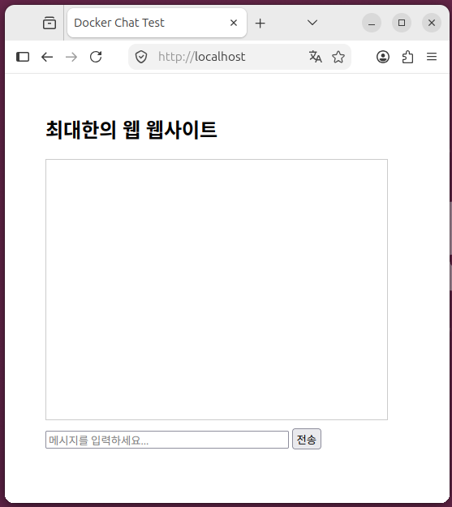

$ curl -I http://localhost/

```
HTTP/1.1 200 OK
Server: nginx/1.31.3
Date: Sat, 15 Aug 2026 18:52:42 GMT
Content-Type: text/html
Content-Length: 817
Last-Modified: Fri, 07 Aug 2026 18:09:15 GMT
Connection: keep-alive
ETag: "6a761f4b-331"
Accept-Ranges: bytes
```

$ 접속 화면



* Docker Port 접속 경로 확인

$ docker ps -a

```
CONTAINER ID   IMAGE      COMMAND                  CREATED      STATUS                        PORTS                                 NAMES
7f1977b2a3af   my-image   "/docker-entrypoint.…"   2 days ago   Exited (255) 38 seconds ago   0.0.0.0:80->80/tcp, [::]:80->80/tcp   my-web-container
```

* 도커 포트 바꾸기

$ sudo docker ps -a

> CONTAINER ID   IMAGE     COMMAND   CREATED   STATUS    PORTS     NAMES

$ sudo docker images

```
IMAGE                ID             DISK USAGE   CONTENT SIZE   EXTRA
hello-world:latest   5dd0d3e6e255       25.9kB         9.49kB        
my-image:latest      d836d6e08412        238MB         63.1MB        
ubuntu:latest        678c6550cc43        160MB         45.3MB
```

$ sudo docker run -d -p 80:80 my-image:latest

> 395b30159c26cfa3f27498d5b9fd5d6b7e3b8c6322ff9ee51c2147b3a7d70ebf

$ docker ps

```
CONTAINER ID   IMAGE             COMMAND                  CREATED          STATUS          PORTS                                 NAMES
395b30159c26   my-image:latest   "/docker-entrypoint.…"   51 seconds ago   Up 50 seconds   0.0.0.0:80->80/tcp, [::]:80->80/tcp   loving_chatelet
```

$ sudo docker ps -a

```
CONTAINER ID   IMAGE             COMMAND                  CREATED              STATUS              PORTS                                 NAMES
395b30159c26   my-image:latest   "/docker-entrypoint.…"   About a minute ago   Up About a minute   0.0.0.0:80->80/tcp, [::]:80->80/tcp   loving_chatelet
```

$ docker stop 395b30159c26

> 395b30159c26

$ docker rm 395b30159c26

> 395b30159c26

$ sudo docker run -d -p 81:81 my-image:latest

> 87be889a156dbdaeb44525cf5fc9b166a267035b7a1e10b34009059a31209424

$ docker ps

```
CONTAINER ID   IMAGE             COMMAND                  CREATED          STATUS          PORTS                                         NAMES
87be889a156d   my-image:latest   "/docker-entrypoint.…"   14 seconds ago   Up 13 seconds   80/tcp, 0.0.0.0:81->81/tcp, [::]:81->81/tcp   cranky_leavitt
```