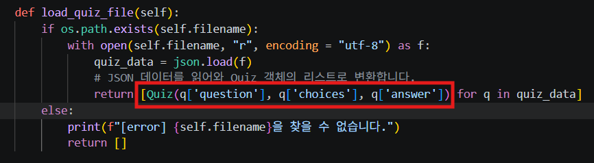
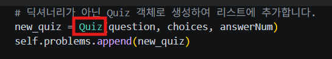

* 체크리스트

프로젝트 개요
----------
```
Python을 이용한 프로그램을 만들어 보고, Python의 기본 문법을 사용해서 입력/출력 흐름을 만들고, 클래스(객체 지향)으로 코드를 역할별로 구조화해봅니다.
```
 
 퀴즈 주제 선정 이유
 ----------
 ```
 Python을 통해, 입력, 출력, 데이터 불러오기, 예외처리를 학습하기 위한 주제이다.
 ```

실행 방법
-----------
* window이면 window shell로 실행
* Mac이면 clie로 실행

> 해당 main.py까지 갑니다. 해당 위치에서 python main.py를 입력해 출력합니다.

기능 목록(퀴즈 풀기/추가/목록/점수)

* Python 3.10 이상에서 동작
* 외부 라이브러리 없이 표준 라이브러리만 사용
----------
Quiz.py
> 객체 '생성자' 메서드
> 
> 퀴즈 파일 딕셔너리로 변환

QuizGame.py에서 Quiz class를 import해서 사용하는 부분





|메서드명|유형|역할 및 설명|
|-----|-----|-----|
|__init__|생성자|질문, 보기 목록, 정답 번호를 받아 객체의 초기 상태를 설정|
|to_dict|인스턴스 메서드|객체 데이터를 JSON 파일 저장에 용이한 파이썬 딕셔너리 형태로 변환|
|from_dict|클래스 메서드 (@classmethod)|저장된 딕셔너리 데이터를 읽어와 새로운 Quiz 객체 인스턴스로 생성|
|display_quiz|인스턴스 메서드|퀴즈의 질문과 보기들을 1번부터 차례대로 콘솔에 출력|
|check_answer|인스턴스 메서드|사용자의 입력값을 안전하게 비교하여 정답 여부(True/False)를 반환합니다.|


QuizGame.py
> 게임 진행

|기능 구분| 주요 함수| 설명|
|--------|--------|-----|
|초기화|__init__|일 부재 시 기본 퀴즈를 설정|
|데이터 저장|play_quiz|등록된 문제를 순차적으로 출력하고 사용자의 입력을 받아 점수를 계산합니다|
|퀴즈 추가|add_quiz|새로운 문제와 선택지, 정답을 입력받아 객체를 생성하고 파일에 반영합니다.|
|퀴즈 목록, 최고 점수 조회|show_quiz_list, show_best_score|등록된 퀴즈 제목 목록과 역대 최고 점수 기록을 확인합니다|
|메뉴|Menu|메뉴를 보여줍니다.|

* 예외 사항 처리
```
* 공백, 빈 입력, 범위 밖 숫자 입력, 숫자외 문자열 같은 입력 처리 완료
* Ctrl + C 입력 스트림 종료 처리 완료
* quiz.json 파일이 없으면 생성
```

git
-------
[수행 로그 01](./log,image/GitLog01.md)

[수행 로그 02](./log,image/GitLog02.md)


과제 목표
-------
1. 변수가 무엇인지, 왜 사용하는지
 > 특정한 값을 저장할 수 있는 메모리 공간

2. int, str, list, dict의 차이
```
int : 정수형을 처리하기 위한 변수
str : 여러 문자들이 순서대로 나열된 것. 또는 이를 표현한 자료구조.
bool : 참(True)과 거짓(False) 두 가지 값만을 가지는 가장 기본적인 데이터 타입
list : 여러 데이터를 하나로 묶어 저장하고, 효율적으로 관리·검색·처리하기 위해 만들어진 자료구조입니다. 리스트는 대괄호 []를 사용하여 생성하며, 값들은 쉼표로 구분됩니다.
dict : 키(Key)와 값(Value)의 쌍으로 이루어진 자료형입니다.
```

3. if/elif/else 로 조건에 따른 동작 설명
```
if : 가장 처음 검사하는 조건문
elif : if 조건 이후, 두 번째 조건문으로 사용.
else : 모든 조건을 마치고, 마지막에 사용. 필수는 아닙니다.
```

4. for, while의 차이
```
for : 횟수가 정해져 있는 반복문.
while : 특정 조건이 만족될때까지 반복하는 조건문.
```

5. 함수, 매개변수, 반환값
```
함수 : 특정 작업을 수행하기 위한 코드의 묶음
매개변수 : 함수를 호출할 때 함수 안으로 전달될 변수
반환값 : 함수가 모든 작업을 끝나고 외부로 결과를 반환
```

6. 클래스가 무엇이고, 왜 사용하는지 설명
```
똑같은 코드를 반복해서 사용하고, 관리와 수정을 편하기 위해서.
```

7. __init__ 메서드와 self의 역할
```
__init__은 생성자로 클래스가 객체(인스턴스)가 생성될때 가장 먼저 호출되서 속성을 설정

self는 객체가 생성된 후 자기 자신의 속성과 메서드를 사용할 수 있게 만듭니다.
```

8. 클래스의 속성과 메서드
```
class Dog:
    # __init__ 메서드: 객체의 속성을 초기화
    def __init__(self, name, breed):
        # --- [속성 (Attribute)] 정의 ---
        self.name = name      # 강아지 이름
        self.breed = breed    # 강아지 품종

    # --- [메서드 (Method)] 정의 ---
    def bark(self):
        # 메서드 내부에서 self를 통해 속성(name)을 활용
        print(f"{self.name}가(이) 멍멍 짖습니다!")

    def introduce(self):
        print(f"저의 이름은 {self.name}이고, 품종은 {self.breed}입니다.")

# 객체 생성
my_dog = Dog("초코", "푸들")

# 속성 접근
print(my_dog.name)  # 출력: 초코

# 메서드 호출
my_dog.bark()       # 출력: 초코가(이) 멍멍 짖습니다!
my_dog.introduce()  # 출력: 저의 이름은 초코이고, 품종은 푸들입니다.
```