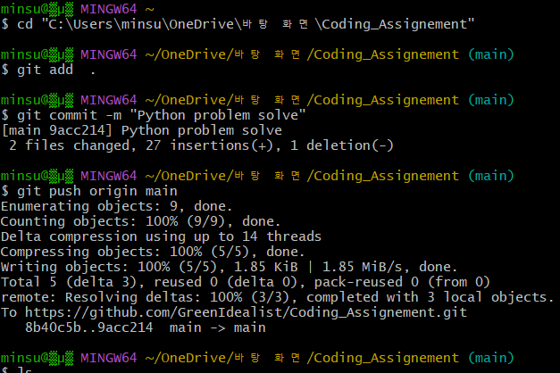

minsu@▒μ▒ MINGW64 ~/OneDrive/바탕 화면/Coding_Assignement (main)
> $ git add  .

minsu@▒μ▒ MINGW64 ~/OneDrive/바탕 화면/Coding_Assignement (main)
> $ git commit -m "Python problem solve"
> 
[main 9acc214] Python problem solve
 2 files changed, 27 insertions(+), 1 deletion(-)

minsu@▒μ▒ MINGW64 ~/OneDrive/바탕 화면/Coding_Assignement (main)
> $ git push origin main
> 
Enumerating objects: 9, done.
Counting objects: 100% (9/9), done.
Delta compression using up to 14 threads
Compressing objects: 100% (5/5), done.
Writing objects: 100% (5/5), 1.85 KiB | 1.85 MiB/s, done.
Total 5 (delta 3), reused 0 (delta 0), pack-reused 0 (from 0)
remote: Resolving deltas: 100% (3/3), completed with 3 local objects.
To https://github.com/GreenIdealist/Coding_Assignement.git
   8b40c5b..9acc214  main -> main

minsu@▒μ▒ MINGW64 ~/OneDrive/바탕 화면/Coding_Assignement (main)



git log

```
commit e3eaa9e592cfca4d03e4d4960b8bc0d0a21a3bcb (HEAD -> main, origin/main)
Author: GreenIdealist <minsung1066@gmail.com>
Date:   Tue Aug 18 20:11:19 2026 +0900

    python edit

commit 1bb128a52523b905a83a7f70d1f42cdd9d7aad57
Author: GreenIdealist <minsung1066@gmail.com>
Date:   Tue Aug 18 12:04:46 2026 +0900

    code eddit

commit 4f85331e2e864b8d7ba622faa0925dc828ae6e79
Author: GreenIdealist <minsung1066@gmail.com>
Date:   Tue Aug 18 11:57:33 2026 +0900

    python edit

commit ae7d31d621df57be5519025dc4adef87faf69c82
Author: GreenIdealist <minsung1066@gmail.com>
Date:   Tue Aug 18 10:42:00 2026 +0900

    add edit

commit 7fba6e9d295989369fddb0ffe4cd42ec2214ceb1
Author: GreenIdealist <minsung1066@gmail.com>
```