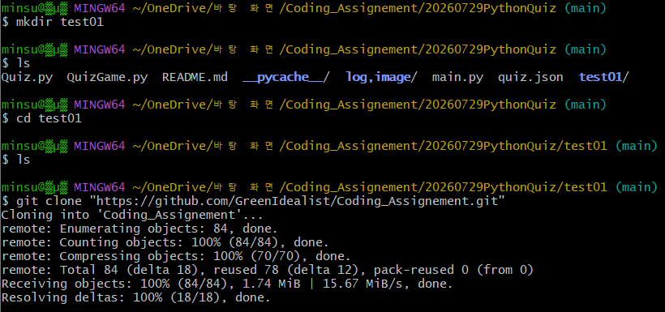
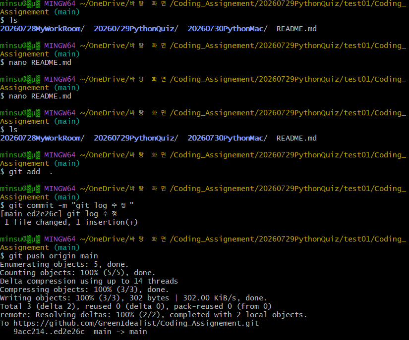

* git

$ $ git clone "https://github.com/GreenIdealist/Coding_Assignement.git"

```
$ git clone "https://github.com/GreenIdealist/Coding_Assignement.git"
Cloning into 'Coding_Assignement'...
remote: Enumerating objects: 84, done.
remote: Counting objects: 100% (84/84), done.
remote: Compressing objects: 100% (70/70), done.
remote: Total 84 (delta 18), reused 78 (delta 12), pack-reused 0 (from 0)
Receiving objects: 100% (84/84), 1.74 MiB | 15.67 MiB/s, done.
Resolving deltas: 100% (18/18), done.

```

$ ls

```
Coding_Assignement/
```

$ ls

```
20260728MyWorkRoom/  20260729PythonQuiz/  20260730PythonMac/  README.md
```

$ nano README.md

```
전 : > 각 폴더에 README.md 파일로 설명이 있습니다.
```

```
후 : > 각 폴더에 README.md 파일로 설명이 있습니다.
> git log
```

$ $ git add  .
```
```

$ git commit -m "git log 수정"
```
[main ed2e26c] git log 수정
 1 file changed, 1 insertion(+)
```

$ git push origin main

```
$ git push origin main
Enumerating objects: 5, done.
Counting objects: 100% (5/5), done.
Delta compression using up to 14 threads
Compressing objects: 100% (3/3), done.
Writing objects: 100% (3/3), 302 bytes | 302.00 KiB/s, done.
Total 3 (delta 2), reused 0 (delta 0), pack-reused 0 (from 0)
remote: Resolving deltas: 100% (2/2), completed with 2 local objects.
To https://github.com/GreenIdealist/Coding_Assignement.git
   9acc214..ed2e26c  main -> main
```




